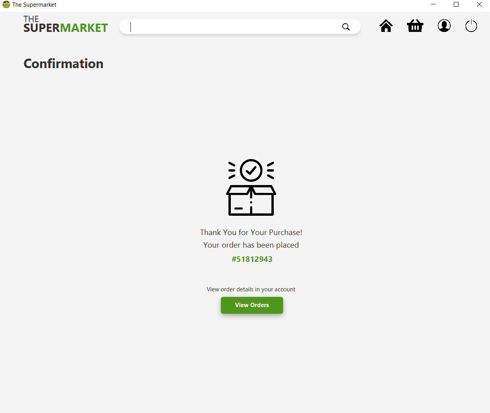

# Supermarket-Management-System-Application

The Supermarket Management System is a desktop application that provides warehouse services for business owners and online shopping for customers.
The application helps effectively organize warehouse operations for placing/maintaining goods and helps reach out to customers who want to shop remotely.
The system provides an easy solution for customers to buy the products without going to the physical store. The system is easy to use with a user-friendly interface.
More information in the Software Requirements Specification document.

Java Dekstop Application Screenshots:

